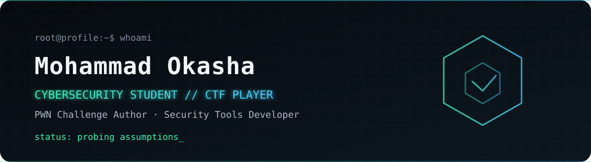

<div align="center">
  <picture>
    <source media="(prefers-color-scheme: dark)" srcset="./assets/header-dark.svg">
    <source media="(prefers-color-scheme: light)" srcset="./assets/header-light.svg">
    
  </picture>
</div>

```console
mohammad@lab:~$ ./identify --concise
identity  Mohammad Okasha
role      Cybersecurity Student · CTF Player · PWN Challenge Author
focus     Binary Exploitation · Web Security · Network Analysis · SOC
mission   Build security tools. Break assumptions. Document what survives.
```

## Security, explored from the inside out

I focus on practical cybersecurity: solving CTF challenges, studying binary exploitation, analyzing network traffic, and building security tools that turn theory into repeatable workflows. Full-stack development supports that work by helping me understand—and test—the systems behind modern applications.

## Field notes

| Event | Result | Work |
|---|---:|---|
| **NCSCJO CTF** | **5th place** · 4,199 points · 16 solves | Crypto, Web, OSINT, Linux |
| **Breakers × CYSTECH CTF** | **PWN Challenge Author** · 140+ teams | Authored 4 challenges: 1 easy, 2 medium, 1 hard; prepared exploitation paths and solutions |
| **CYSTECH CTF** | **Top 5 team** | Competitive security problem-solving |

## Featured projects

| Project | Focus | Stack |
|---|---|---|
| [**Port Scanner**](https://github.com/MOOKTY/port-scanner) | Lightweight sequential TCP connect scanning with target and port-range validation, configurable timeouts, and safe socket cleanup. Built for authorized labs and networking education. | Python · TCP/IP · Sockets |
| [**Password Strength Checker**](https://github.com/MOOKTY/password-strength-checker) | Local password strength evaluation using five simple checks: minimum length, uppercase letter, lowercase letter, digit, and special character. | Python · Regex · pyfiglet |

Additional security projects will be added one at a time after source review, secrets scanning, and documentation.

## Technical orbit

| Domain | Tools & technologies |
|---|---|
| **Offensive & CTF** | Binary Exploitation, PWN, Web Security, GDB, pwndbg, pwntools, Burp Suite |
| **Detection & Analysis** | SOC, SIEM, Splunk, Wireshark, PCAP Analysis, Network Security, OSINT |
| **Engineering** | Python, Java, Bash, JavaScript, PHP, HTML, CSS, Dart, C# |
| **Platforms** | Linux, Windows, MySQL |

## Signal

<div align="center">
  <picture>
    <source media="(prefers-color-scheme: dark)" srcset="https://raw.githubusercontent.com/MOOKTY/MOOKTY/gh-pages/github-contribution-grid-snake-dark.svg">
    <source media="(prefers-color-scheme: light)" srcset="https://raw.githubusercontent.com/MOOKTY/MOOKTY/gh-pages/github-contribution-grid-snake.svg">
    
  </picture>
</div>

## Contact

[GitHub](https://github.com/MOOKTY) · Open to CTF collaboration and security-focused projects

<div align="center">
  <sub>Cybersecurity first · Development with purpose · Claims backed by inspected work</sub>
</div>
